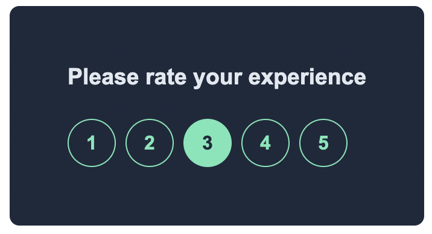

# Rating App

Welcome to the Rating App! This is a simple full-stack application developed as part of a coding bootcamp project. The app allows users to rate a service or product on a scale of 1 to 5. It provides a user-friendly interface and captures user ratings through a React front-end and communicates with a backend API.

## User Interface

The user interface of the Rating App is designed to be intuitive and easy to use. Here's a screenshot of how it looks:

## How It Works

The Rating App utilizes the following technologies:

- React: A popular JavaScript library for building user interfaces.
- Axios: A promise-based HTTP client for making API requests.

When the app is launched, users are presented with a rating interface. They can choose a rating from 1 to 5 by clicking on the corresponding number. Once a rating is selected, the app sends a POST request to the backend API to store the rating.

## Setting Up and Running the App

To set up and run the Rating App on your local machine, follow these steps:

1. Clone the repository from GitHub.
2. Navigate to the project directory using the command line.
3. Install the necessary dependencies by running the command `npm install`.
4. Start the development server with the command `npm start`.
5. Open [http://localhost:3000](http://localhost:3000) in your browser to view the app.

## Available Scripts

In the project directory, you can run the following scripts:

### `npm start`

Runs the app in development mode. It opens [http://localhost:3000](http://localhost:3000) in your browser and reloads the page whenever you make changes. You can see any lint errors in the console.

### `npm test`

Launches the test runner in interactive watch mode. This allows you to run tests and see the results as you make changes to the code. Refer to the [running tests](https://facebook.github.io/create-react-app/docs/running-tests) documentation for more details.

### `npm run build`

Builds the app for production to the `build` folder. It optimizes the build for better performance and generates minified files with hashed filenames. The build output can be deployed to a web server. See the [deployment](https://facebook.github.io/create-react-app/docs/deployment) documentation for more information.

## Conclusion

The Rating App is a simple example of a full-stack application. Users provide ratings on a scale of 1 to 5. It incorporates a user-friendly interface with communication between the React front-end and the backend API. If you have any questions or feedback, please don't hesitate to get in touch. Happy rating!
